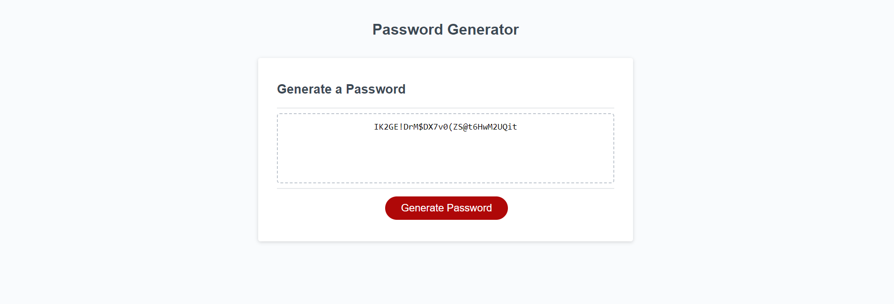

# password-generator

## Description
This project is a password generator. The program takes in user input and then generates a password based on the choices of the user. Using functions allowed me to take info in and then calculate the user input to spit out a password.

### Screenshot
 

### Deployed website link
[Password Generator]